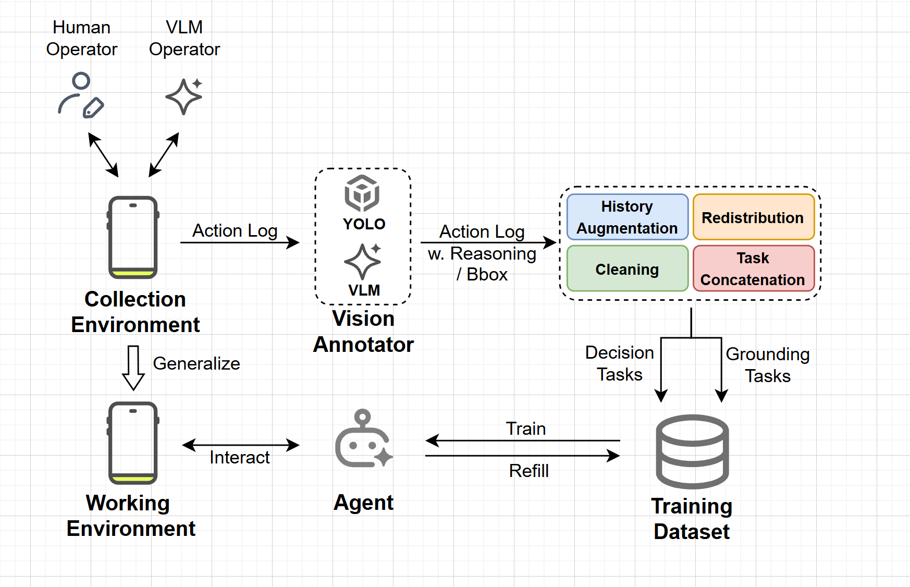

# Simple-AgentRR: 移动设备AI智能体数据收集与训练平台

## 环境配置
```bash
conda create -n agentRR python=3.10
conda activate agentRR
conda install pytorch torchvision torchaudio pytorch-cuda=11.8 -c pytorch -c nvidia -y
python -m pip install paddlepaddle-gpu==3.1.0 -i https://www.paddlepaddle.org.cn/packages/stable/cu118/
pip install paddleocr==2.10.0 ultralytics transformers==4.47.0 Pillow opencv-python numpy scipy supervision langchain-openai langchain-core
pip install openai uiautomator2 pillow
pip install fastapi uvicorn

for f in icon_detect/{train_args.yaml,model.pt,model.yaml} ; do huggingface-cli download microsoft/OmniParser-v2.0 "$f" --local-dir weights; done
```

## 手机配置
- 在Android设备上安装项目根目录中的 `ADBKeyboard.apk` 文件，必须开启开发者选项
- 使用USB数据线连接手机和电脑
- 手机上会弹出USB调试授权提示，点击 **允许**

## 项目启动
详情见子目录 README.md

### 数据收集

#### 数据格式

通过人工/自动收集工具，收集每个action前的手机截图，并记录每个action的信息，并汇总到一个actions.json文件中。action格式如下：
```
{{
    "app_name": str
    "task_description": ["The description of the task list."],
    "action_count": "The count of the actions.",
    "actions": [
        {{
            "type": "The type of the action",
            "parameters": "etc.",  
        }},
        {{
            "type": "click",
            "position_x": "x-coordinate of click",
            "position_y": "y-coordinate of click action",
            "bounds": "the bound of the clicked element",
        }},
        {{
            "type": "swipe",
            "press_position_x": "x-coordinate of press",
            "press_position_y": "y-coordinate of press",
            "release_position_x": "x-coordinate of release",
            "release_position_y": "y-coordinate of release",
            "direction": "The direction of the user's swipe gesture. UP: swipe finger upward to scroll content up and reveal content below. DOWN: swipe finger downward to scroll content down and reveal content above. LEFT: swipe finger leftward to scroll content left. RIGHT: swipe finger rightward to scroll content right."
        }},
        {{
            "type": "input",
            "text": "The text to input",
        }},
        {{
            "type": "done"
        }},
        {{
            "type": "wait"
        }},
    ]
}}
```

#### 手动数据收集

**启动服务器**
```bash
python -m collect.manual_collection.server
```
启动成功后，访问 http://localhost:9000 进入Web操作界面。

**操作步骤**

1. **开始收集**：在Web界面点击 **开始收集** 按钮

2. **配置应用信息**：在弹出的 **应用信息配置** 窗口中填写：
- **应用名称**：如 "饿了么"、"微信"、"淘宝" 等
- **任务类型**：如 “tpye1”、 “tpye2” 等，具体参考收集任务文档

3. **输入任务描述**
   - 在 **任务描述** 窗口中详细描述当前要执行的具体任务
   - 确保描述清晰明确，便于后续数据分析和模型训练

4. **执行操作**
   - 在Web界面的手机截图上进行以下操作：
     - **点击操作**：直接点击截图上的目标位置
     - **滑动操作**：按住鼠标左键拖拽到目标位置后松开（注意保持在屏幕范围内）
     - **文本输入**：点击 **文本输入** 按钮，在弹出框中输入文本内容

5. **保存数据**
   - 完成一个任务序列后，根据需要选择：
     - **下一条数据**：继续收集同类型任务的更多数据样本
     - **结束收集**：完成当前收集会话并保存所有数据
     - **删除任务**：丢弃当前数据（用于处理错误操作或无效数据）

**数据存储格式**

收集的数据自动保存到 `collect/manual_collection/data/` 目录，按以下层级结构组织：

```
data/
├── <应用名称>/
│   ├── <任务类型>/
│   │   ├── 1/
│   │   │   ├── 1.jpg          # 第1个操作前的截图
│   │   │   ├── 2.jpg          # 第2个操作前的截图
│   │   │   ├── ...
│   │   │   └── actions.json   # 操作记录和任务信息
│   │   ├── 2/
│   │   │   └── ...            # 第2条数据
│   │   └── ...
│   └── <其他任务类型>/
└── <其他应用名称>/
```

每个数据样本包含：
- **截图序列**：记录每个操作步骤前的界面状态
- **actions.json**：包含完整的操作序列、任务描述和应用信息

#### 自动数据收集
先在 `/collect/auto_collection/task.json` 写入需要完成的任务列表，格式为字符串数组：
```json
[
    "在淘宝搜索iPhone手机",
    "在微信给张三发消息说你好",
    "在b站关注up主李四"
]
```

运行自动数据收集程序：
```bash
python -m collect.auto_collection.server --model <模型名称> --api_key <API密钥> --base_url <API基础URL> [--max_steps <最大步数>]
```

**必需参数：**
- `--model`：LLM模型名称
- `--api_key`：API密钥
- `--base_url`：API基础URL

**可选参数：**
- `--max_steps`：每个任务的最大执行步数，默认为 15

**工作流程：**
1. 程序读取 `task.json` 中的任务列表
2. 对每个任务：
   - AI智能体根据任务描述自动选择并启动相应的应用
   - 自动执行操作序列（点击、滑动、输入等）
   - 每步操作前自动截图并记录操作信息
   - 达到最大步数或任务完成时停止
3. 自动保存数据到指定目录

**存储数据格式：**
- 原始日志数据存储在 `/collect/auto_collection/data_log/` 
- 转换后的标准格式数据存储在 `/collect/auto_collection/data/`
- 数据结构与手动收集保持一致，包含截图序列和 `actions.json` 文件

### 数据标注

数据标注模块将原始的操作数据转换为带有视觉标注的数据，为通用AI模型提供更丰富的上下文信息，使得其能够提供更加准确的reasoning。

#### 视觉标注格式

**操作标注**
- 用户每个时间步的操作以 **红色字体** 标注在对应截图的顶部
- 辅助信息同时在截图中进行可视化标注：
  - **点击操作**：在操作位置标注 **红色圆圈**
  - **滑动操作**：用 **红色箭头** 标示从起始位置到结束位置的方向

**数据生成**
系统将标注后的截图序列和任务描述发送给大模型，生成 `react.json` 文件，包含推理过程和操作决策：

```json
[
    {
        "reasoning": "选择此操作类型的推理过程和原因",
        "function": {
            "name": "click",
            "parameters": {
                "target_element": "点击目标的高级语义描述"
            }
        }
    },
    {
        "reasoning": "滑动操作的推理过程",
        "function": {
            "name": "swipe",
            "parameters": {
                "direction": "UP, DOWN, LEFT, RIGHT"
            }
        }
    },
    {
        "reasoning": "文本输入的推理过程",
        "function": {
            "name": "input",
            "parameters": {
                "text": "要输入的文本内容"
            }
        }
    },
    {
        "reasoning": "任务完成的判断依据",
        "function": {
            "name": "done",
            "parameters": {}
        }
    },
    {
        "reasoning": "等待操作的原因说明",
        "function": {
            "name": "wait",
            "parameters": {}
        }
    }
]
```

#### 自动标注执行

**启动命令**
```bash
python -m annotation.auto_annotate --data_path <数据路径> --model <模型名称> --api_key <API密钥> --base_url <API基础URL>
```

**参数说明**
- `--data_path`：原始轨迹数据存储路径（可选，默认为当前目录下的 `data` 目录）
- `--model`：大语言模型名称（必需）
- `--api_key`：模型服务API密钥（必需）
- `--base_url`：模型服务基础URL（必需）

**处理流程**
1. 读取原始数据目录中的截图序列和 `actions.json` 文件
2. 根据操作信息在截图上添加视觉标注
3. 将标注后的数据发送给大模型进行推理分析
4. 生成包含推理过程的 `react.json` 文件
5. 保存完整的标注数据集，用于后续模型训练

**输出数据**
- 带有视觉标注的截图序列
- 包含推理过程的 `react.json` 文件
- 原始的 `actions.json` 文件（保持不变）

**数据存储格式**

收集的数据自动保存到对应目录，按以下层级结构组织：

```
data/
├── <应用名称>/
│   ├── <任务类型>/
│   │   ├── 1/
│   │   │   ├── 1.jpg          # 第1个操作前的截图
│   │   │   ├── 2.jpg          # 第2个操作前的截图
│   │   │   ├── ...
│   │   │   └── actions.json   # 操作记录和任务信息
│   │   │   └── react.json     # 标注数据
│   │   ├── 2/
│   │   │   └── ...            # 第2条数据
│   │   └── ...
│   └── <其他任务类型>/
└── <其他应用名称>/
```


### 数据构建
```bash
python -m construct_data.sft
```
#### 训练集生成

1. decider模型
entry粒度为每一个action
@dataclass
class AlpacaImageEntry:
    instruction: str
    output: str
    images: List[str]
    input: str = ""
    
- in：actions' history, task description, current img
- out：react.json中一条对应的实例，如下
{
    "reasoning": "选择这个function type（action type）的原因",
    "function": {
        "name": "click, input, swipe, done, wait",
        "parameters": {
            "target_element": "click的highlevel描述",
            "direction": "UP, DOWN, LEFT, RIGHT",
                "text": "input的内容"
        }
    }
}

2. grounder模型
type1:
in：target element's description 和 reasoning
out：bounds box [x1, x2, y1, y2]
type2:
- in：target element's description 和 reasoning
- out：coordinates [x, y]

### Simple-AgentRR 智能体执行器
```bash
python -m simple_agentRR.simple_agentRR
```

## 项目结构

- `annotation/` - 数据标注模块，自动为收集的数据添加视觉标注
- `auto_collection/` - 自动数据收集模块，通过AI智能体自动执行任务并收集数据
- `construct_data/` - 数据构建模块，将原始数据转换为训练格式
- `manual_collection/` - 手动数据收集模块，提供Web界面进行人工数据收集
- `simple_agentRR/` - 核心智能体模块，实现移动设备的AI自动化操作
- `prompts/` - 提示词模板
- `utils/` - 工具函数库
- `weights/` - 模型权重文件

## 详细文档

每个子模块都有独立的README文档，详细说明使用方法和配置选项。请参考对应目录下的README.md文件。

## 数据流


### 定义动作空间
1. **CLICK [x,y]**: The user clicked on the screen at the position [x,y]. The origin [0,0] is at the top-left corner of the screen, x is the horizontal coordinate, and y is the vertical coordinate. Both x and y are relative coordinates, ranging from 0 to 1000. For example, [500,500] is the center of the screen, and [1000,1000] is the bottom-right corner of the screen.
2. **INPUT `<text>`**: The user typed the text `<text>` using the keyboard. The text can contain characters in any language. The action only happens when the user has already clicked on a search bar or a text input field, and the keyboard is activated.
3. **SWIPE [x1,y1] to [x2,y2]**: The user swiped from the position [x1,y1] to the position [x2,y2]. The meaning of x1, y1, x2, and y2 is the same as in the CLICK action.
4. **DONE**: The user has successfully completed the assigned task. This action indicates that all required objectives have been accomplished and no further interaction is needed.
5. **wait***: Wait to ad, load and redirect

## 支持功能
- 论坛文章视频类（小红书，b站，知乎等）
1. 关注xx，进入主页
2. 搜索，打开，播放
3. 在用户主页搜索，打开，播放
3. 点赞，收藏，评论，转发

- 社交软件类（微信QQ等）
1. 发消息，打电话，打视频，查找聊天内容
2. @某人+发消息
3. 打开小程序，打开朋友圈（打开朋友圈评论我们这个框架肯定可以）

- 购物类（淘宝，京东等）
1. 搜索，按照价格销量等排序搜索，打开搜索结果
2. 加入购物车和下单，选择对应规格加入购物车和下单
3. 关注店铺

- 外卖类（饿了么，美团）
1. 点外卖，包括选择规格和数量

- 旅游类（飞猪，去哪儿，携程，同城，华住会）
1. 查询酒店价格（地点，地标附近，指定酒店，日期）
2. 预定酒店（地点，地标附近，指定酒店，日期，房间类型）
3. 购买火车票飞机票（和设定始发地和目的地，以及日期时间段）

- 地图类（高德）
1. 导航，打车（始发地，目的地可以更改）

- 听歌类（网易云，QQ音乐）
1. 搜索歌曲，歌手，乐队
2. 搜索并播放