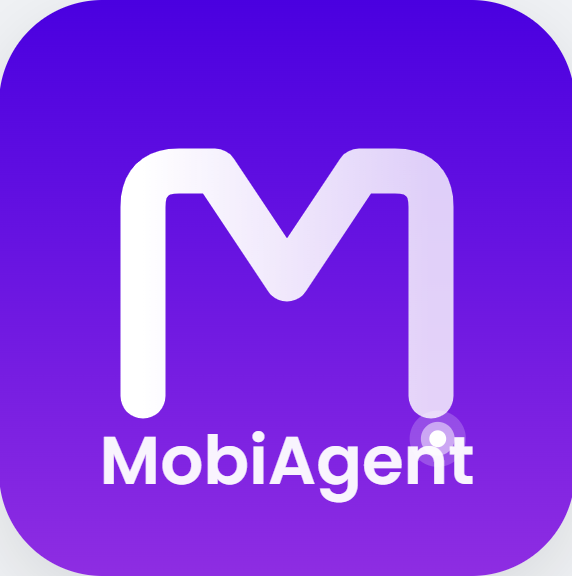
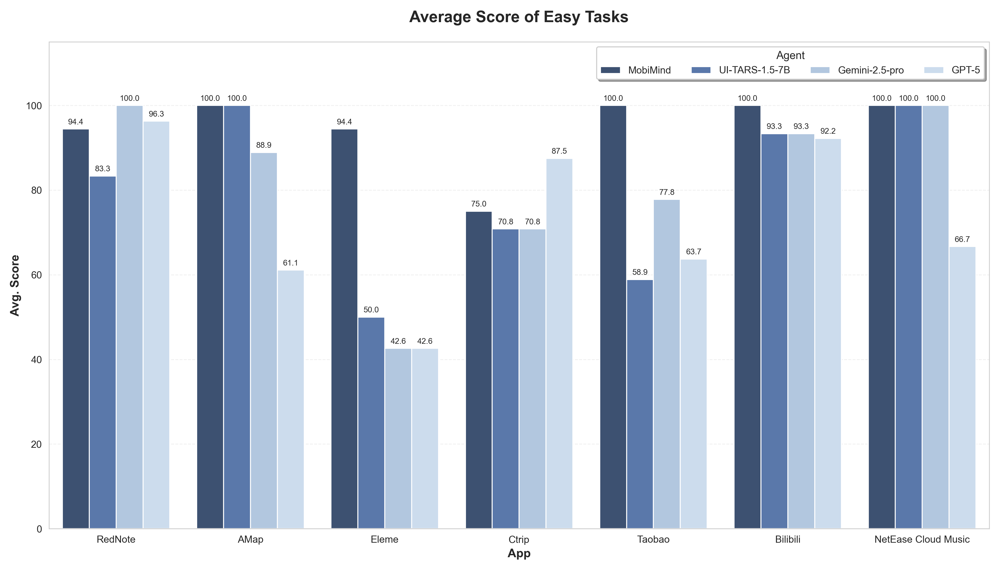
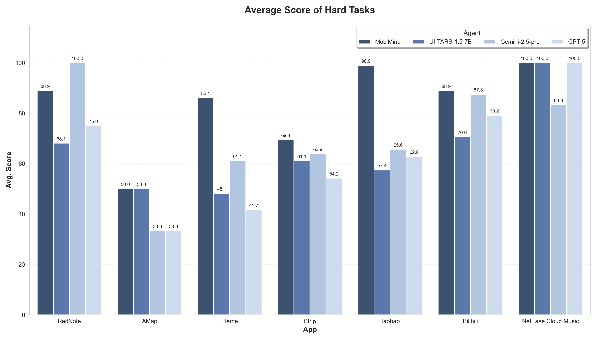

# MobiAgent

<div align="center">
<p align="center">
  
</p>
</div>

## 📢News
- `[2025.8.29]`🔥🔥 We've open-sourced the MobiAgent.

## 📊Results

<div align="center">
<p align="center">
  
  
  
</p>
</div>


## 环境配置
```bash
conda create -n MobiMind python=3.10
conda activate MobiMind

pip install -r requirements.txt

# 下载OmniParser模型权重
for f in icon_detect/{train_args.yaml,model.pt,model.yaml} ; do huggingface-cli download microsoft/OmniParser-v2.0 "$f" --local-dir weights; done

# 如果需要使用gpu加速ocr，需要根据cuda版本，手动安装paddlepaddle-gpu
# 详情参考 https://www.paddlepaddle.org.cn/install/quick，例如cuda 11.8版本：
python -m pip install paddlepaddle-gpu==3.1.0 -i https://www.paddlepaddle.org.cn/packages/stable/cu118/

```

## 手机配置
- 在Android设备上下载并安装 [ADBKeyboard](https://github.com/senzhk/ADBKeyBoard/blob/master/ADBKeyboard.apk)
- 在Android设备上，开启开发者选项，并允许USB调试
- 使用USB数据线连接手机和电脑

## 项目结构

- `agent_rr/` - Agent Record & Replay框架
- `collect/` - 数据收集、标注、处理与导出工具
- `runner/` - 智能体执行器，通过ADB连接手机、执行任务、并记录执行轨迹
- `MobiFlow/` - 基于里程碑DAG的智能体评测基准
- `deployment/` - MobiAgent移动端应用的服务部署方式

## 子模块使用方式
详细使用方式见各子模块目录下的 `README.md` 文件